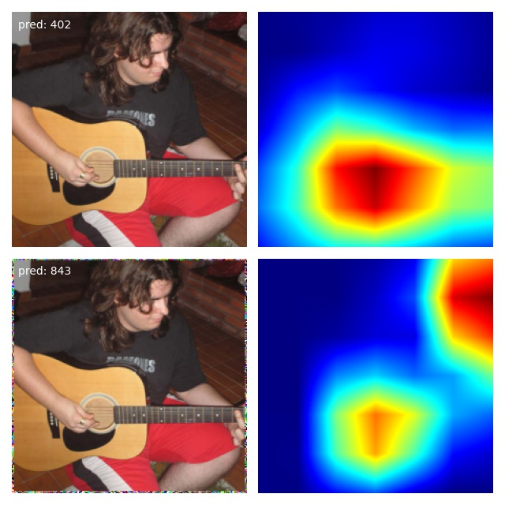

# CAM-Adversarial-Marginal-Attack (PyTorch)

<div align=center>  </div>

[On the Receptive Field Misalignment in CAM-based Visual Explanations](https://www.sciencedirect.com/science/article/pii/S0167865521003810)

Pengfei Xia, Hongjing Niu, Ziqiang Li, and Bin Li, *Pattern Recognition Letters*, 2021.

>Abstract: *Visual explanations aim at providing an understanding of the inner behavior of convolutional neural networks. Naturally, it is necessary to explore whether these methods themselves are reasonable and reliable. In this paper, we focus on Class Activation Mapping (CAM), a type of attractive explanations that has been widely applied to model diagnosis and weakly supervised tasks. Our contribution is two-fold. First, we identify an important but neglected issue that affects the reliability of CAM results: there is a misalignment between the effective receptive field and the implicit receptive field, where the former is determined by the model and the input, and the latter is determined by the upsampling function in CAM. Occlusion experiments are designed to empirically testify to its existence. Second, based on this finding, an adversarial marginal attack is proposed to fool the CAM-based method and the CNN model simultaneously. Experimental results demonstrate that the provided saliency map can be completely changed to another shape by only perturbing the area with 1-pixel width.*

## Attacking

```python
# Attack an image with e set to 2
python attack.py --model_name resnet101 --image ./figures/test.jpg --e 2
```


## Citation

If you find this work useful for your research, please consider citing our paper:

```
@article{xia2021receptive,
  title={On the Receptive Field Misalignment in CAM-based Visual Explanations},
  author={Xia, Pengfei and Niu, Hongjing and Li, Ziqiang and Li, Bin},
  journal={Pattern Recognition Letters},
  volume={152},
  pages={275--282},
  year={2021},
  publisher={Elsevier}
}
```
